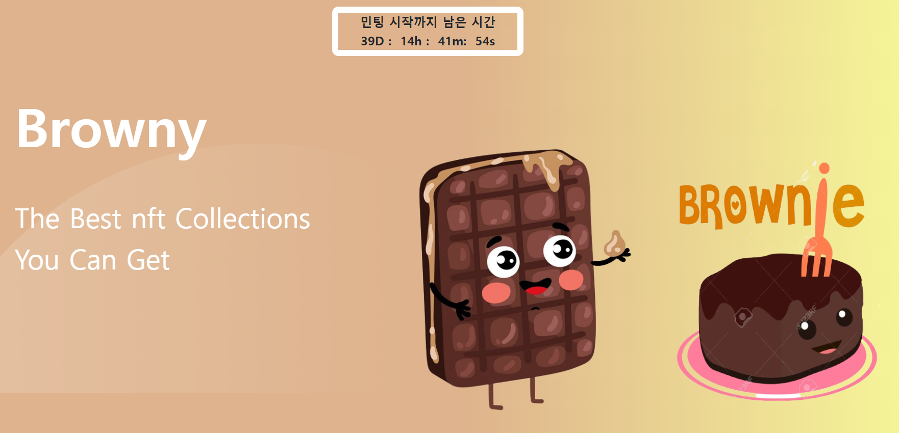

# 🥨 BROWNY NFT


## 🧇 프로젝트 진행 기간
2022.06.02 ~ 예정 없음
경일게임 아카데미 블록체인4기 기업 협약 프로젝트 - BROWNY NFT
</br>

## 🥯 BROWNY 주요 기술
---

**Backend - Express.js**
- Visual Studio Code
- Node.js 16.14
- MariaDB

**BlockChain - klaytn**
- Solidity 0.8.4
- openzeppelin/contracts
- KLAYTN - IDE

**Storage**
- IPFS
- IPFS-Cluster

**Frontend**
- React
- Redux
- Web3.js
- FIGMA
- caver

**Environment**
- GCP VM INSTANCE
- PM2
- GCP SQL


## ✔ 프로젝트 파일 구조
---
### Frontend

```
front
├─ .env
├─ config-overrides.js
├─ jsconfig.json
├─ package-lock.json
├─ package.json
├─ public
│  ├─ BLogo.ico
│  ├─ BLogo.png
│  └─ index.html
├─ README.md
└─ src
   ├─ api
   │  ├─ contractMethods.js
   │  ├─ customHook.js
   │  ├─ index.js
   │  ├─ kaikas.js
   │  ├─ utils.js
   │  ├─ viewMethods.js
   │  └─ votingMethods.js
   ├─ App.css
   ├─ App.js
   ├─ components
   │  ├─ AlertModal.js
   │  ├─ Animation.js
   │  ├─ ChangeNicknameModal.js
   │  ├─ ClockTest.js
   │  ├─ collection
   │  │  ├─ CollectionMain.js
   │  │  ├─ collectionModule.js
   │  │  ├─ DetailCollecion.js
   │  │  ├─ DetailCollectionModal.js
   │  │  ├─ Filter.js
   │  │  ├─ FilterDetail.js
   │  │  ├─ Sort.js
   │  │  └─ SortTop.js
   │  ├─ EarthVote.js
   │  ├─ Footer.js
   │  ├─ Header.js
   │  ├─ home
   │  │  ├─ D3.js
   │  │  ├─ Home.js
   │  │  ├─ HomeImgCard.js
   │  │  ├─ HomeImgCardMain.js
   │  │  ├─ HomeImgCardSide.js
   │  │  ├─ homeModule.js
   │  │  ├─ SlideShow.js
   │  │  ├─ Team.js
   │  │  ├─ TeamCard.js
   │  │  └─ Viliage.js
   │  ├─ MainHeader.js
   │  ├─ mint
   │  │  ├─ MintCard.js
   │  │  └─ PreSale.js
   │  ├─ Profile.js
   │  ├─ Proposal.js
   │  ├─ QuitMint.js
   │  ├─ QuitVote.js
   │  ├─ Slider.js
   │  ├─ SlideTest.js
   │  ├─ stake
   │  │  ├─ CardContainer.js
   │  │  ├─ CardHead.js
   │  │  ├─ NftCard.js
   │  │  ├─ Pagination.js
   │  │  └─ Reward.js
   │  ├─ swap
   │  │  ├─ SwapBody.js
   │  │  ├─ SwapFooter.js
   │  │  └─ SwapHeader.js
   │  ├─ vote
   │  │  ├─ CommunityApproval.js
   │  │  ├─ CommunityPostButton.js
   │  │  ├─ CommunityRead.js
   │  │  ├─ CommunityTable.js
   │  │  ├─ CommunityTopic.js
   │  │  ├─ CommunityVoteTable.js
   │  │  ├─ ImageSelect.js
   │  │  ├─ VoteDescription.js
   │  │  ├─ VoteDetail.js
   │  │  ├─ voteModule.js
   │  │  └─ VoteTableCard.js
   │  └─ WhiteListMember.js
   ├─ configs
   │  ├─ abi
   │  │  ├─ index.js
   │  │  ├─ mintingAbi.json
   │  │  ├─ nftAbi.json
   │  │  ├─ tokenAbi.json
   │  │  ├─ votingAbi.json
   │  │  └─ whitelistAbi.json
   │  ├─ caverjs.js
   │  ├─ contractAddress.js
   │  ├─ contractInstance.js
   │  └─ index.js
   ├─ font
   │  ├─ Y 너만을 비춤체_매뉴얼.pdf
   │  ├─ Y1.otf
   │  └─ Y2.ttf
   ├─ img
   │  ├─ arrow.png
   │  ├─ background
   │  │  ├─ back12.png
   │  │  ├─ back13.png
   │  │  ├─ background1.jpg
   │  │  ├─ background10.png
   │  │  ├─ background11.png
   │  │  ├─ background2.jpg
   │  │  ├─ background3.jpg
   │  │  ├─ background4.jpg
   │  │  ├─ background5.jpg
   │  │  ├─ background6.jpg
   │  │  ├─ background7.jpg
   │  │  ├─ background8.jpg
   │  │  └─ index.js
   │  ├─ browny
   │  │  ├─ browny10.png
   │  │  ├─ browny6.jpg
   │  │  ├─ browny7.png
   │  │  ├─ browny8.png
   │  │  ├─ browny9.png
   │  │  ├─ group1.png
   │  │  ├─ group2.png
   │  │  ├─ img1.png
   │  │  └─ index.js
   │  ├─ brownyLogo.png
   │  ├─ check.png
   │  ├─ exit.png
   │  ├─ footer
   │  │  ├─ disc.png
   │  │  ├─ footer.png
   │  │  ├─ index.js
   │  │  ├─ inst.png
   │  │  ├─ kakao1.png
   │  │  ├─ kakao2.png
   │  │  ├─ tele.png
   │  │  └─ twit.png
   │  ├─ index.js
   │  ├─ main1.jpg
   │  ├─ main2.jpg
   │  ├─ main3.jpg
   │  ├─ mint
   │  │  ├─ background7.png
   │  │  └─ fireplace.png
   │  ├─ nft
   │  │  ├─ 1.png
   │  │  ├─ 10.png
   │  │  ├─ 11.png
   │  │  ├─ 12.png
   │  │  ├─ 13.png
   │  │  ├─ 14.png
   │  │  ├─ 15.png
   │  │  ├─ 16.png
   │  │  ├─ 2.png
   │  │  ├─ 3.png
   │  │  ├─ 4.png
   │  │  ├─ 5.png
   │  │  ├─ 6.png
   │  │  ├─ 7.png
   │  │  ├─ 8.png
   │  │  ├─ 9.png
   │  │  └─ index.js
   │  ├─ stake
   │  │  ├─ cancel.png
   │  │  └─ check.png
   │  ├─ swap
   │  │  ├─ arrowRight.png
   │  │  ├─ browny1.png
   │  │  └─ klaytn.png
   │  ├─ trash.png
   │  ├─ trash2.png
   │  ├─ viliage.png
   │  ├─ viliage2.jpeg
   │  └─ vote
   │     ├─ delete.png
   │     ├─ detail
   │     │  ├─ Epro.png
   │     │  ├─ index.js
   │     │  ├─ Kpro1.png
   │     │  ├─ ModalAni1.png
   │     │  └─ ModalKpro.png
   │     └─ organizations
   │        ├─ Ani1.png
   │        ├─ Ani2.png
   │        ├─ Ani3.png
   │        ├─ Apro.png
   │        ├─ Ep1.png
   │        ├─ Ep2.png
   │        ├─ Ep3.png
   │        ├─ index.js
   │        ├─ Kp1.png
   │        ├─ Kp2.png
   │        └─ Kp3.png
   ├─ index.js
   ├─ page
   │  ├─ AdminPage.js
   │  ├─ Collection.js
   │  ├─ Community.js
   │  ├─ DifNetwork.js
   │  ├─ HomePage.js
   │  ├─ index.js
   │  ├─ Mint.js
   │  ├─ NftList.js
   │  ├─ NoPage.js
   │  ├─ Swap.js
   │  ├─ Testpage.js
   │  ├─ VoteWrite.js
   │  ├─ Voting.js
   │  └─ WhiteList.js
   ├─ redux
   │  ├─ actions
   │  │  └─ nftAction.js
   │  ├─ reducers
   │  │  ├─ index.js
   │  │  └─ nftReducer.js
   │  └─ store.js
   ├─ route
   │  ├─ CommunityReadRoute.js
   │  ├─ CommunityWriteRoute.js
   │  ├─ index.js
   │  └─ PrivateRoute.js
   ├─ scss
   │  ├─ detailCollecion.css
   │  └─ style.css
   └─ styles
      ├─ slider.css
      └─ stopwatch.css
```

### Backend

```
back
├─ .env
├─ db.js
├─ package-lock.json
├─ package.json
├─ routes
│  ├─ communityRouter
│  │  ├─ community.control.js
│  │  └─ index.js
│  ├─ imageRouter
│  │  ├─ images.control.js
│  │  ├─ index.js
│  │  └─ s3.js
│  ├─ index.js
│  ├─ userRouter
│  │  ├─ index.js
│  │  └─ user.control.js
│  ├─ voteRouter
│  │  ├─ index.js
│  │  └─ vote.control.js
│  └─ whiteRouter
│     ├─ index.js
│     └─ white.control.js
├─ server.js
└─ sql
   ├─ community.sql
   ├─ users.sql
   ├─ voting.sql
   └─ whitelist.sql

```

### BlockChain
```
sol
└─ proxycontract
   ├─ Minting
   │  ├─ Minting.sol
   │  ├─ MintingBeacon.sol
   │  └─ MintingFactory.sol
   ├─ NFT
   │  ├─ NFT copy.sol
   │  ├─ NFT.sol
   │  ├─ NFTBeacon.sol
   │  └─ NFTFactory.sol
   ├─ NormalListTokenId.sol
   ├─ Token
   │  ├─ Token.sol
   │  ├─ TokenBeacon.sol
   │  └─ TokenFactory.sol
   ├─ Voting.sol
   ├─ Whitelist
   │  ├─ Whitelist.sol
   │  ├─ WhitelistBeacon.sol
   │  └─ WhitelistFactory.sol
   └─ WhiteListTokenId.sol

```

## ✔ 협업 툴
---
- Github
- Notion
- Discord
